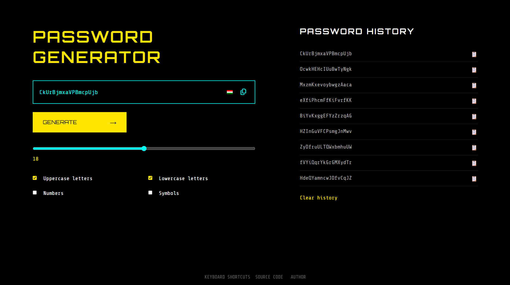

# 🔐 Password Generator

A simple and secure **Password Generator website** built using **HTML, CSS, and JavaScript**.  
This application allows users to generate strong random passwords and stores previously generated passwords using **Local Storage**.

---

## 🌐 Website Live At

👉 **Live URL:** https://sharafath07.github.io/password-generator/

*(Replace this link with your actual deployed website URL)*

---

## 📌 Features

- Generate strong random passwords
- Choose password length using a slider
- Include:
  - Uppercase letters
  - Lowercase letters
  - Numbers
  - Symbols
- Copy password to clipboard
- Password history saved using **localStorage**
- Click history item to copy again
- Clear password history
- Responsive design (Desktop & Mobile)
- Clean cyber-style UI

---

## 🛠️ Technologies Used

- **HTML5**
- **CSS3**
- **JavaScript (ES6)**
- **Local Storage API**

---

## 📂 Project Structure

password-generator/
│
├── index.html
├── script.js
├── README.md

---

## 🚀 How to Run the Project

1. Download or clone the repository
2. Open `index.html` in any modern web browser
3. Start generating secure passwords 🎉

---

## 🧠 How It Works

- Passwords are generated based on selected options
- Clicking **Copy** saves the password to local storage
- Password history persists even after page refresh
- Responsive layout adjusts automatically for mobile screens

---

## 👤 Author

**Sharafath Ahammed V**

---

## 📄 License

This project is for **educational and learning purposes**.

---

⭐ If you like this project, feel free to use or improve it!
